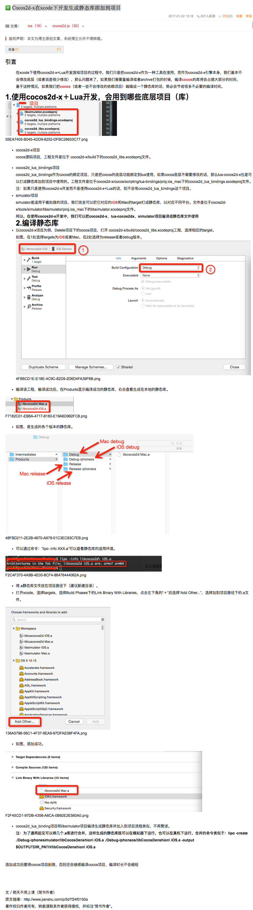

# cocos2d

##cocos2dxlua3.15iOS模拟器崩溃
- [cocos2dxlua3.15iOS模拟器崩溃](http://www.cnblogs.com/skar/p/7066254.html)

- [CocosCreator手记03——配置VSCode的TypeScript环境](http://www.tuicool.com/articles/U3mU3my)

## 常见错误
- [常见错误](常见错误.md)

## vungle广告集成

- [Vungle CN](https://support.vungle.com/hc/zh-cn)

- [Vungle SDK](https://dashboard.vungle.com/sdk)

- [Vungle集成文档](https://support.vungle.com/hc/en-us/articles/115000477452)

- [SDKBOX集成Vungle](http://docs.sdkbox.com/zh/plugins/vungle/v3-cpp/)
已测试sdkbox list中已经没有vungle选项

## SDKBOX集成
<pre>
sdkbox import vungle --server china
</pre>

[SDKBOX安装](http://docs.sdkbox.com/en/installer/)

[SDKBOX GITHUB](https://github.com/sdkbox/sdkbox-sample-vungle)

## cocos2d framework

- 添加cocos2dlib工程到framework中
- 添加search等cocos2d的路径搜索
- 添加cocos2dios.a等相关库
- 编译生成framework
>1. Edit Scheme，Build Configuration下选择Release 
>2. 真机 编译生成Release版的framework
>3. Edit Scheme，Build Configuration下选择Debug
>4. 模拟器 编译生成Debug版的framework
>5. 使用lipo命令合并生成真机模拟器通用版本

---

## 加速编译

- [cocos2d-x 减少编译时间/免除重复编译](http://blog.csdn.net/u014335219/article/details/50492088)

- [Cocos2dx 3.x 新建项目编译很慢的解决方案windows平台](http://blog.csdn.net/crocodile__/article/details/51133835)

## 着色器shader
[着色器shader](着色器shader.md)

## CSLoader使用
[CSLoader使用](CSLoader使用.md)

## JS到java和oc的反射
[JS到java和oc的反射1][1]
[JS到java和oc的反射2][2]

## Cocos2d-x在xcode下开发生成静态库添加到项目 ##
[Cocos2d-x在xcode下开发生成静态库添加到项目][3]

[1]:http://www.cocos.com/docs//doc/article/index?type=cocos2d-x&url=/doc/cocos-docs-master/manual/framework/html5/v3/reflection/zh.md
[2]:http://www.cocos.com/docs/article/index?type=cocos2d-x&url=/doc/cocos-docs-master/manual/framework/html5/v3/reflection-oc/zh.md 
[3]:http://blog.csdn.net/vivi_12/article/details/54668714