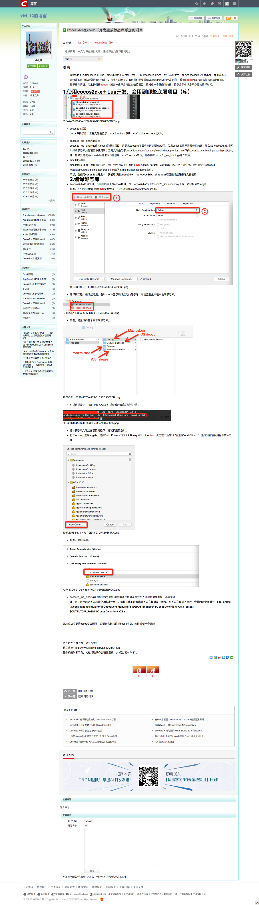

# cocos2d

## 着色器shader
[着色器shader](着色器shader.md)

## CSLoader使用
[CSLoader使用](CSLoader使用.md)

## JS到java和oc的反射
[JS到java和oc的反射1][1]
[JS到java和oc的反射2][2]

## Cocos2d-x在xcode下开发生成静态库添加到项目

[Cocos2d-x在xcode下开发生成静态库添加到项目][3]

[1]:http://www.cocos.com/docs//doc/article/index?type=cocos2d-x&url=/doc/cocos-docs-master/manual/framework/html5/v3/reflection/zh.md
[2]:http://www.cocos.com/docs/article/index?type=cocos2d-x&url=/doc/cocos-docs-master/manual/framework/html5/v3/reflection-oc/zh.md 
[3]:http://blog.csdn.net/vivi_12/article/details/54668714