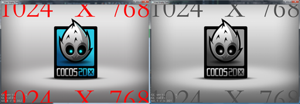

# 着色器shader

## 使用方法
<pre>
    auto sp = Sprite::create("");
    auto state = GLProgramState::getOrCreateWithGLProgramName(GLProgram::SHADER_NAME_POSITION_GRAYSCALE);
    sp->setGLProgramState(state);
</pre>

 - - -
## 常用shader
<pre>
    //彩色转灰度
    GLProgram::SHADER_NAME_POSITION_GRAYSCALE
</pre>

 - - -
## 内置着色器测试
<pre>
    std::vector<std::string>shaderNameArr = {
        GLProgram::SHADER_NAME_ETC1AS_POSITION_TEXTURE_COLOR,
        GLProgram::SHADER_NAME_ETC1AS_POSITION_TEXTURE_COLOR_NO_MVP,
        GLProgram::SHADER_NAME_ETC1AS_POSITION_TEXTURE_GRAY,
        GLProgram::SHADER_NAME_ETC1AS_POSITION_TEXTURE_GRAY_NO_MVP,
        GLProgram::SHADER_NAME_POSITION_TEXTURE_COLOR,
        GLProgram::SHADER_NAME_POSITION_TEXTURE_COLOR_NO_MVP,
        GLProgram::SHADER_NAME_POSITION_TEXTURE_ALPHA_TEST,
        GLProgram::SHADER_NAME_POSITION_TEXTURE_ALPHA_TEST_NO_MV,
        GLProgram::SHADER_NAME_POSITION_COLOR,
        GLProgram::SHADER_NAME_POSITION_COLOR_TEXASPOINTSIZE,
        GLProgram::SHADER_NAME_POSITION_COLOR_NO_MVP,
        GLProgram::SHADER_NAME_POSITION_TEXTURE,
        GLProgram::SHADER_NAME_POSITION_TEXTURE_U_COLOR,
        GLProgram::SHADER_NAME_POSITION_TEXTURE_A8_COLOR,
        GLProgram::SHADER_NAME_POSITION_U_COLOR,
        GLProgram::SHADER_NAME_POSITION_LENGTH_TEXTURE_COLOR,
        GLProgram::SHADER_NAME_POSITION_GRAYSCALE,
        GLProgram::SHADER_NAME_LABEL_NORMAL,
        GLProgram::SHADER_NAME_LABEL_OUTLINE,
        GLProgram::SHADER_NAME_LABEL_DISTANCEFIELD_NORMAL,
        GLProgram::SHADER_NAME_LABEL_DISTANCEFIELD_GLOW,
        GLProgram::SHADER_3D_POSITION,
        GLProgram::SHADER_3D_POSITION_TEXTURE,
        GLProgram::SHADER_3D_SKINPOSITION_TEXTURE,
        GLProgram::SHADER_3D_POSITION_NORMAL,
        GLProgram::SHADER_3D_POSITION_NORMAL_TEXTURE,
        GLProgram::SHADER_3D_SKINPOSITION_NORMAL_TEXTURE,
        GLProgram::SHADER_3D_POSITION_BUMPEDNORMAL_TEXTURE,
        GLProgram::SHADER_3D_SKINPOSITION_BUMPEDNORMAL_TEXTURE,
        GLProgram::SHADER_3D_PARTICLE_TEXTURE,
        GLProgram::SHADER_3D_PARTICLE_COLOR,
        GLProgram::SHADER_3D_SKYBOX,
        GLProgram::SHADER_3D_TERRAIN,
        GLProgram::SHADER_CAMERA_CLEAR
    };
    
    for (size_t i = 0; i < shaderNameArr.size(); ++i) {
        auto sp = Sprite::create("ResourceUpdate/gengxin_0001.png");
        auto state = GLProgramState::getOrCreateWithGLProgramName(shaderNameArr.at(i));
        sp->setGLProgramState(state);
        sp->setPosition(100 * (1 + i % 10), 100 * (1 + i / 10));
        this->addChild(sp, 30);
    }
</pre>

 - - -
## 自定义shader
自定义shader，首先得要定义自己的顶点着色器和像素着色器，下面是一个很简单的彩色转灰度图的shader
<pre>
    /*顶点着色器*/
    const char* vert = R"(
    attribute vec4 a_position;
    attribute vec2 a_texCoord;
    attribute vec4 a_color;
    varying vec4 v_fragmentColor;
    varying vec2 v_texCoord;
    void main()
    {
        gl_Position = CC_PMatrix * a_position;
        v_fragmentColor = a_color;
        v_texCoord = a_texCoord;
    }
    )";
    /*像素着色器*/
    const char* frag = R"(
    varying vec4 v_fragmentColor;
    varying vec2 v_texCoord;
    void main()
    {
        vec4 v_orColor = v_fragmentColor *texture2D(CC_Texture0, v_texCoord);
        float gray = dot(v_orColor.rgb, vec3(0.299,0.587, 0.114));
        gl_FragColor = vec4(gray, gray, gray, v_orColor.a);
    }
    )";
</pre>
cocos2dx中使用GLProgram来管理shader，使用GLProgramCache来缓存加载完成的GLProgram
<pre>
    GLProgram* p = GLProgram::createWithByteArrays(vert, frag);
    GLProgramCache::getInstance()->addGLProgram(p, "gray");
</pre>
之后就可以在需要的地方使用这个shader了
<pre>
    auto sprite = Sprite::create("HelloWorld.png");
    addChild(sprite);
    sprite->setPosition(visibleSize.width / 2, visibleSize.height / 2);
    auto shaderState = GLProgramState::getOrCreateWithGLProgramName("gray");
    sprite->setGLProgramState(shaderState);
</pre>

效果图对比

 - - -
## shader的CC_Time的使用

cocos2dx为shader提供了3个跟时间有关的uniform变量
<pre>
const char* GLProgram::UNIFORM_NAME_TIME = "CC_Time";
const char* GLProgram::UNIFORM_NAME_SIN_TIME = "CC_SinTime";
const char* GLProgram::UNIFORM_NAME_COS_TIME = "CC_CosTime";
</pre>
赋值为
<pre>
 if (_flags.usesTime) {
        // This doesn't give the most accurate global time value.
        // Cocos2D doesn't store a high precision time value, so this will have to do.
        // Getting Mach time per frame per shader using time could be extremely expensive.
        /*程序运行时间*/
        float time = _director->getTotalFrames() * _director->getAnimationInterval();

        setUniformLocationWith4f(_builtInUniforms[GLProgram::UNIFORM_TIME], time/10.0, time, time*2, time*4);
        setUniformLocationWith4f(_builtInUniforms[GLProgram::UNIFORM_SIN_TIME], time/8.0, time/4.0, time/2.0, sinf(time));
        setUniformLocationWith4f(_builtInUniforms[GLProgram::UNIFORM_COS_TIME], time/8.0, time/4.0, time/2.0, cosf(time));
    }
</pre>
<pre>
time是程序启动到现在经历的秒数 
CC_Time 赋值为time/10.0, time, time*2, time*4 
CC_SinTime 赋值为time/8.0, time/4.0, time/2.0, sinf(time) 
CC_CosTime 赋值为time/8.0, time/4.0, time/2.0, cosf(time)
</pre>
使用这些uniform变量，可以产生一些随时间变化的动画效果
<pre>
const char* vert = R"(
    attribute vec4 a_position;
    attribute vec2 a_texCoord;

    varying vec2 v_texCoord;

    void main()
    {
        gl_Position = CC_PMatrix * a_position;
        v_texCoord = a_texCoord;
    }
)";

const char* frag = R"(
    varying vec2 v_texCoord;

    void main()
    {
        vec4 col = texture2D(CC_Texture0, v_texCoord);
        gl_FragColor = col*CC_SinTime.w;
        gl_FragColor.a = col.a;
    }
)";
</pre>

<pre>
GLProgram* p = GLProgram::createWithByteArrays(vert, frag);
GLProgramCache::getInstance()->addGLProgram(p, "time");

auto sprite = Sprite::create("HelloWorld.png");
addChild(sprite);
sprite->setPosition(visibleSize.width / 2, visibleSize.height / 2);
auto shaderState = GLProgramState::getOrCreateWithGLProgramName("time");
sprite->setGLProgramState(shaderState);
</pre>

这个shader可以使图片随时间产生忽明忽暗的动画效果

- - -
## shader的CC_Random01的使用

cocos2dx为shader提供了一个uniform变量，他可以是一个0-1直接的随机变量，需要注意的是它在一次渲染过程中保持不变，而下一次渲染时才会变成另一个随机量。
<pre>
const char* GLProgram::UNIFORM_NAME_RANDOM01 = "CC_Random01";
</pre>
赋值为
<pre>
if (_flags.usesRandom)
       setUniformLocationWith4f(_builtInUniforms[GLProgram::UNIFORM_RANDOM01], CCRANDOM_0_1(), CCRANDOM_0_1(), CCRANDOM_0_1(), CCRANDOM_0_1());
</pre>
利用这个随机量，可以产生一些随机动画效果，比如下面的shader会产生随机闪烁的效果
<pre>
const char* vert = R"(
    attribute vec4 a_position;
    attribute vec2 a_texCoord;

    varying vec2 v_texCoord;

    void main()
    {
        gl_Position = CC_PMatrix * a_position;
        v_texCoord = a_texCoord;
    }
)";

const char* frag = R"(
    varying vec2 v_texCoord;

    void main()
    {
        vec4 col = texture2D(CC_Texture0, v_texCoord);
        gl_FragColor = col*CC_Random01.x;
        gl_FragColor.a = col.a;
    }
)";
</pre>
<pre>
GLProgram* p = GLProgram::createWithByteArrays(vert, frag);
GLProgramCache::getInstance()->addGLProgram(p, "random");

auto sprite = Sprite::create("HelloWorld.png");
addChild(sprite);
sprite->setPosition(visibleSize.width / 2, visibleSize.height / 2);
auto shaderState = GLProgramState::getOrCreateWithGLProgramName("random");
sprite->setGLProgramState(shaderState);
</pre>

- - -
## shader使用自定义uniform变量
cocos2dx引擎本身提供了一定数量的uniform
<pre>
static const char * COCOS2D_SHADER_UNIFORMS =
        "uniform mat4 CC_PMatrix;\n"
        "uniform mat4 CC_MVMatrix;\n"
        "uniform mat4 CC_MVPMatrix;\n"
        "uniform mat3 CC_NormalMatrix;\n"
        "uniform vec4 CC_Time;\n"
        "uniform vec4 CC_SinTime;\n"
        "uniform vec4 CC_CosTime;\n"
        "uniform vec4 CC_Random01;\n"
        "uniform sampler2D CC_Texture0;\n"
        "uniform sampler2D CC_Texture1;\n"
        "uniform sampler2D CC_Texture2;\n"
        "uniform sampler2D CC_Texture3;\n"
        "//CC INCLUDES END\n\n";
</pre>
但并不能满足我们所有的需要，这时就需要使用自定义uniform 
首先写好我们的shader，带上自定义uniform变量
<pre>
const char* vert = R"(
    attribute vec4 a_position;
    attribute vec2 a_texCoord;

    varying vec2 v_texCoord;

    void main()
    {
        gl_Position = CC_PMatrix * a_position;
        v_texCoord = a_texCoord;
    }
)";

const char* frag = R"(
    varying vec2 v_texCoord;
    // 自定义uniform变量
    uniform float custom;
    void main()
    {
        vec4 col = texture2D(CC_Texture0, v_texCoord);
        gl_FragColor = col*custom;
        gl_FragColor.a = col.a;
    }
)";
</pre>
下一步就需要在程序中设置这个uniform变量的值，我们可以每一帧对他进行一些改变，从而产生一些动画效果。
<pre>
GLProgram* p = GLProgram::createWithByteArrays(vert, frag);
GLProgramCache::getInstance()->addGLProgram(p, "custom");

auto sprite = Sprite::create("HelloWorld.png");
addChild(sprite);
sprite->setPosition(visibleSize.width / 2, visibleSize.height / 2);
auto shaderState = GLProgramState::getOrCreateWithGLProgramName("custom");
//设置自定义uniform变量的值
shaderState->setUniformFloat("custom", 0.2f);
sprite->setGLProgramState(shaderState);
</pre>

## 使用shader改变精灵的颜色
<pre>
    const char* vert = R"(
    attribute vec4 a_position;
    attribute vec2 a_texCoord;
    
    varying vec2 v_texCoord;
    
    void main()
    {
        gl_Position = CC_PMatrix * a_position;
        v_texCoord = a_texCoord;
    }
    )";
    
    const char* frag = R"(
    varying vec2 v_texCoord;
    uniform float percent;
    void main()
    {
        vec4 col = texture2D(CC_Texture0, v_texCoord);
        gl_FragColor = col*1.0;
        if (col.a > 0.8) {
            float f = percent;
            gl_FragColor.r = gl_FragColor.r + (1.0 - gl_FragColor.r) * f;
            gl_FragColor.g = gl_FragColor.g + (1.0 - gl_FragColor.g) * f;
            gl_FragColor.b = gl_FragColor.b + (1.0 - gl_FragColor.b) * f;
        }
    }
    )";
    GLProgram* p = GLProgram::createWithByteArrays(vert, frag);
    GLProgramCache::getInstance()->addGLProgram(p, "X__GRAY");
    auto sp = Sprite::create("ResourceUpdate/gengxin_0001.png");
    auto state = GLProgramState::getOrCreateWithGLProgramName("X__GRAY");
    //percent(0.0 - 1.0)从原色到纯白色
    state->setUniformFloat("percent", 0.0f);
    sp->setGLProgramState(state);
    sp->setPosition(512, 384);
    this->addChild(sp, 30);
    float dt = 10.0;
    float* bt = new float(0.0);
    this->schedule([=](float f){
        *bt += f;
        if (*bt > dt) {
            state->setUniformFloat("percent", 1.0f);
            this->unschedule("test");
        }
        else {
            state->setUniformFloat("percent", *bt / dt);
        }
    }, 0.1, "test");
</pre>

## 高斯模糊
<pre>
#ifdef GL_ES
precision mediump float;
#endif

varying vec4 v_fragmentColor;
varying vec2 v_texCoord;

uniform vec2 resolution;//模糊对象的实际分辨率
uniform float blurRadius;//半径
uniform float sampleNum;//间隔的段数

vec4 blur(vec2);

void main(void)
{
    vec4 col = blur(v_texCoord); //* v_fragmentColor.rgb;
    gl_FragColor = vec4(col) * v_fragmentColor;
}

vec4 blur(vec2 p)
{
    if (blurRadius > 0.0 && sampleNum > 1.0)
    {
        vec4 col = vec4(0);
        vec2 unit = 1.0 / resolution.xy;//单位坐标

        float r = blurRadius;
        float sampleStep = r / sampleNum;

        float count = 0.0;
        //遍历一个矩形，当前的坐标为中心点，遍历矩形中每个像素点的颜色
        for(float x = -r; x < r; x += sampleStep)
        {
            for(float y = -r; y < r; y += sampleStep)
            {
                float weight = (r - abs(x)) * (r - abs(y));//权重，p点的权重最高，向四周依次减少
                col += texture2D(CC_Texture0, p + vec2(x * unit.x, y * unit.y)) * weight;
                count += weight;
            }
        }
        //得到实际模糊颜色的值
        return col / count;
    }

    return texture2D(CC_Texture0, p);
}
</pre>

## 链接
[资料来源][1]
[高斯模糊算法][2]

[1]:http://blog.csdn.net/xtchina/article/details/51862293
[2]:https://baike.baidu.com/item/%E9%AB%98%E6%96%AF%E6%A8%A1%E7%B3%8A?fr=aladdin