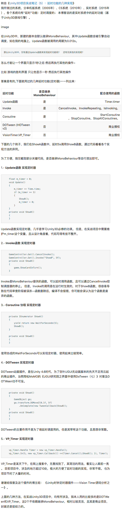
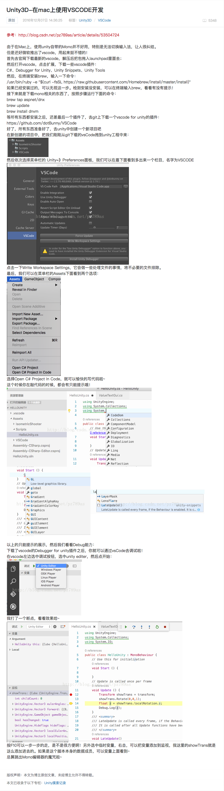
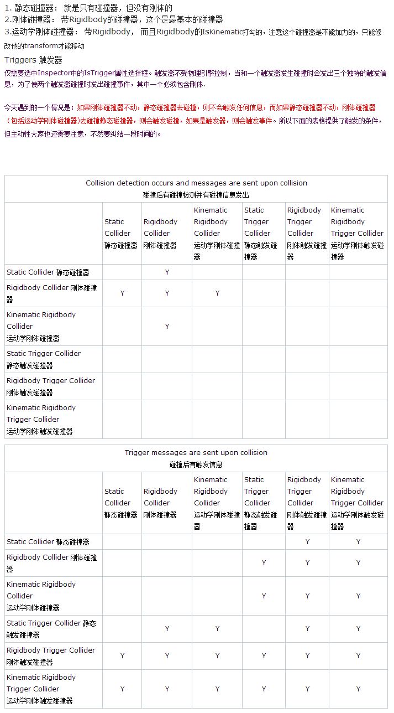

# unity3d

## 施加力

### 持续施加
<pre>
	void FixedUpdate()
	{
        Rigidbody2D rb2d;
		//施加力
        rb2.AddForce(offset);
    }
</pre>

### 瞬间施加
<pre>
    Rigidbody2D rb2d;
    //施加力
    rb2.AddForce(offset, ForceMode2D.Impulse);
</pre>

## 修改重力

### 修改世界重力
<pre>
Physics2D.gravity
</pre>

### 修改物体重力
<pre>
Rigidbody2D rb2d;
rb2d.gravityScale = 1.0f;
</pre>

## RectTransform 操作

### 改变位置
1.改变RectTransform的top

GetComponent<RectTransform>().offsetMax = new Vector2(GetComponent<RectTransform>().offsetMax.x, top);

2.改变RectTransform的bottom

GetComponent<RectTransform>().offsetMin = new Vector2(GetComponent<RectTransform>().offsetMin.x, bottom);

3.改变RectTransform的width，height

GetComponent<RectTransform>().sizeDelta = new Vector2(width, height);

4.改变RectTransform的pos

GetComponent<RectTransform>().anchoredPosition3D = new Vector3(posx,posy,posz);

GetComponent<RectTransform>().anchoredPosition = new Vector2(posx,posy);

### 改变大小
GetComponent<RectTransform>().sizeDelta = new Vector2(x, y)

## 获取场景根节点下的对象列表
<pre>
var arr = SceneManager.GetActiveScene().GetRootGameObjects();
</pre>

## 场景跳转

<pre>
using UnityEngine.SceneManagement;
SceneManager.LoadScene("Home");
</pre>

## svn
[svn管理](http://blog.csdn.net/derxiu_xiu/article/details/52369225)

## 字体模糊 3dtext
先放大text的font，再缩小text的scale

## Unity延时

<pre>
    //重复调用  
    InvokeRepeating("LaunchProjectile", 1,5);//1秒后调用LaunchProjectile () 函数，之后每5秒调用一次    
    //调用一次  
    Invoke("LaunchProjectile", 5);//5秒后调用LaunchProjectile () 函数  
</pre>

- [Unity延时功能的几种实现](http://www.jianshu.com/p/e38b926a3b00)

## 平台及环境宏定义
<pre>
    #if UNITY_IOS || UNITY_ANDROID
    ...//这里的代码在IOS和Android平台都会编译
    #endif

    #if UNITY_ANDROID && UNITY_EDITOR
    ...//这里的代码只有在发布设置设置的是Android，且在编辑器里运行时才会编译
    #endif
</pre>

## Unity3D-在mac上使用VSCODE开发
- [Unity3D-在mac上使用VSCODE开发](http://blog.csdn.net/pz789as/article/details/53504724)

## 声音播放
- 添加组件方式播放
给GameObject添加AudioSource组件，设置AudioClip属性
- 代码方式播放

## 跨场景不销毁对象 单例
<pre>
    using UnityEngine;
    using System.Collections;
    
    public class Test : MonoBehaviour 
    {
        public GameObject audio;
        void Start () 
        {
            // 切换场景不施放对象
            DontDestroyOnLoad(audio);
        }
    }
</pre>

## 类型转换
<pre>
    // string 2 float
    float f;
    bool ret = float.TryParse(num, out f);
</pre>

## Unity3d和iOS交互
- unity3d调用iOS方法
1、在unity中声明外部函数
<pre>
    // DllImport这个方法相当于是告诉Unity，有一个unityToIOS函数在外部会实现。
    // 使用这个方法必须要导入System.Runtime.InteropServices;
    // 传递数据只能用以string类型
    [DllImport("__Internal")]
    private static extern void unityToIOS (string str);
</pre>
2、在iOS中实现外部函数
<pre>
    extern "C"
    {
        void functionName(char* str){
            // do something
        }
    }
</pre>

- iOS调用unity3d方法
<pre>
    // UnitySendMessage("gameobject", "Method",msg);
    // 向unity发送消息
    // 参数一为unity脚本挂载的gameobject
    // 参数二为unity脚本中要调用的方法名
    // 参数三为传递的数据，注意：传递的数据只能是char *类型
    const char* str = [[NSString stringWithFormat:@"10"] UTF8String];
    UnitySendMessage("Main Camera", "turnRight", str);
</pre>

- iOS中暂停恢复unity3d方法
<pre>
    UnityPause(true)
    UnityPause(false)
</pre>

## 热更新方案

- [热更新方案](http://blog.csdn.net/guofeng526/article/details/52662994)

## 网络游戏中的攻击判断

- [网络游戏中的攻击行为分析](http://job.17173.com/content/2011-03-28/20110328141845820,1.shtml)

- [网络游戏编程中如何应对并数据处理上的并发](https://www.zhihu.com/question/35703590)

<<网络游戏核心技术与实践>>

- [手游实时战斗的同步问题处理方案详解](http://www.gad.qq.com/article/detail/10121)

- [腾讯GAD](http://www.gad.qq.com/community/program)

尚好的青春

## 服务端

- [WebSocket实战](http://www.cnblogs.com/tinywan/p/6182411.html)

- [Workerman](http://www.workerman.net/)
- [链接1](http://www.workerman.net/gatewaydoc/advanced/push.html)
- [链接2](http://doc.workerman.net/315306)
- [链接3](http://www.workerman.net/gatewaydoc/advanced/file-monitor.html)

## 碰撞

在unity3d中，能检测碰撞发生的方式有两种，一种是利用碰撞器，另一种则是利用触发器。这两种方式的应用非常广泛。为了完整的了解这两种方式，我们必须理解以下概念：
    （一）碰撞器是一群组件，它包含了很多种类，比如：Box Collider，Capsule Collider等，这些碰撞器应用的场合不同，但都必须加到GameObjecet身上。
    （二）所谓触发器，只需要在检视面板中的碰撞器组件中勾选IsTrigger属性选择框。
    （三）在Unity3d中，主要有以下接口函数来处理这两种碰撞检测：

触发信息检测：
1.MonoBehaviour.OnTriggerEnter( Collider other )当进入触发器
2.MonoBehaviour.OnTriggerExit( Collider other )当退出触发器
3.MonoBehaviour.OnTriggerStay( Collider other )当逗留触发器

碰撞信息检测：
1.MonoBehaviour.OnCollisionEnter( Collision collisionInfo ) 当进入碰撞器
2.MonoBehaviour.OnCollisionExit( Collision collisionInfo ) 当退出碰撞器
3.MonoBehaviour.OnCollisionStay( Collision collisionInfo )  当逗留碰撞器

Unity2D:
MonoBehaviour.OnTriggerEnter2D( Collider2D other )

## 查找对象
<pre>
    var followCamera = GameObject.Find ("RenderCamera");
</pre>

## 查找子对象
<pre>
var temp = transform.Find("InfoText");
</pre>

## 添加预设体
<pre>
GameObject obj = (GameObject)Instantiate (Resources.Load ("BodyS"));
GameObject node = GameObject.Find ("Main Camera");
obj.transform.parent = node.transform;
</pre>

## 动态加载资源
<pre>
//资源放在Resources目录中 名称以unity中显示的名称为准
AudioClip clip = (AudioClip)Resources.Load("T-ara - DAY BY DAY", typeof(AudioClip));
</pre>

## 删除对象
<pre>
Destroy(gameObject)
</pre>

## 脚本所在的对象
<pre>
this.gameObject
</pre>

## 添加组件
<pre>
<xmp>AudioSource source = gameObject.AddComponent<AudioSource>();</xmp>
</pre>

## 查找对象上的脚本/组件 查找组件 查找脚本
<pre>
<xmp>Player info = obj.GetComponent<Player>();</xmp>
</pre>

## 获取MAC地址
<pre>
using UnityEngine;  
using System.Collections;  
using System.Net.NetworkInformation;  

public static string GetMacAddress()  
{  
    string physicalAddress = "";  

    NetworkInterface[] nice = NetworkInterface.GetAllNetworkInterfaces();  

    foreach (NetworkInterface adaper in nice)  
    {  

        Debug.Log(adaper.Description);  

        if (adaper.Description == "en0")  
        {  
            physicalAddress = adaper.GetPhysicalAddress().ToString();  
            break;  
        }  
        else  
        {  
            physicalAddress = adaper.GetPhysicalAddress().ToString();  

            if (physicalAddress != "")  
            {  
                break;  
            };  
        }  
    }  

    return physicalAddress;  
} 
</pre>

<pre>
NetworkInterface[] nis = NetworkInterface.GetAllNetworkInterfaces();  
foreach(NetworkInterface ni in nis )  
{  
    Name = ni.Name;  
    Des = ni.Description;  
    Type = ni.NetworkInterfaceType.ToString();  
    Mac = ni.GetPhysicalAddress().ToString();  
    Debug.Log("Name ="+ni.Name);  
    Debug.Log("Des="+ni.Description);  
    Debug.Log("Type ="+ ni.NetworkInterfaceType.ToString());  
    Debug.Log("Mac="+ni.GetPhysicalAddress().ToString());  
}  
</pre>

## 随机数
<pre>
Random.Range(0, Rang);
</pre>

## 获取时间
Unity中时间处理使用的是System.Datetime
<pre>
//取得现在的时间
System.DateTime now = System.DateTime.Now;
//得到任意时间的DateTime（年月日时分秒）
System.DateTime date1 = new DateTime(2010,8,18,16,32,0,DateTimeKind.Local);
</pre>

## 点击到游戏对象的判断
<pre>
Debug.DrawLine (Camera.main.ScreenToWorldPoint (UTouch.Point ()), Vector3.zero);
RaycastHit2D hit = Physics2D.Raycast (Camera.main.ScreenToWorldPoint (UTouch.Point ()), Vector2.zero);
if (hit.collider != null) {
    GameObject obj = hit.collider.gameObject;
    if (obj == this.gameObject) {
        obj.transform.localScale = new Vector3 (2.0f, 2.0f, obj.transform.localScale.y);
        change = true;
    }
}
</pre>

## 现有类方法扩展
方法参数中的this关键词
<pre>
public static class Universal {
    //string to vector3
    public static Vector3 ToVector3(this string text) {
        text = text.Replace ("(", "").Replace (")", "");
        string[] s = text.Split (',');
        if (s.Length == 3) {
            return new Vector3 (float.Parse (s [0]), float.Parse (s [1]), float.Parse (s [2]));
        }
        return Vector3.zero;
    }
}
</pre>

## 点击事件
鼠标和触摸通用点击判断
<pre>
public class UTouch {
    public static bool Began (){
        if (Input.GetMouseButtonDown (0)) {
            return true;
        } else if (Input.touchCount > 0 && Input.GetTouch (0).phase == TouchPhase.Began) {
            return true;
        }
        return false;
    }
    public static bool Moved (){
        if (Input.GetMouseButton (0)) {
            return true;
        } else if (Input.touchCount > 0 && Input.GetTouch (0).phase == TouchPhase.Moved) {
            return true;
        }
        return false;
    }
    public static bool Ended (){
        if (Input.GetMouseButtonUp (0)) {
            return true;
        } else if (Input.touchCount > 0 && Input.GetTouch (0).phase == TouchPhase.Ended) {
            return true;
        }
        return false;
    }
    public static bool Canceled (){
        if (Input.touchCount > 0 && Input.GetTouch (0).phase == TouchPhase.Canceled) {
            return true;
        }
        return false;
    }
    public static Vector2 Point() {
        if (Input.touchCount > 0) {
            return Input.GetTouch (0).position;
        } else {
            return Input.mousePosition;
        }
    }
}
</pre>

## 文件读写
<pre>
var fileAddress = Path.Combine (Application.persistentDataPath, "test.txt");
var fileInfo = new FileInfo (fileAddress);
StreamWriter w;
if (!fileInfo.Exists) {
    w = File.CreateText (fileAddress);
}
else {
    w = new StreamWriter (fileAddress);
}
w.WriteLine ("123");
w.Close ();

if (fileInfo.Exists) {
    StreamReader r = new StreamReader (fileAddress);
    var s = r.ReadToEnd ();
    Debug.Log (s);
    r.Close ();
}
</pre>

## 目录权限
iOS:
Application.dataPath :                    Application/xxxxxxxx-xxxx-xxxx-xxxx-xxxxxxxxxxxx/xxx.app/Data
Application.streamingAssetsPath : Application/xxxxxxxx-xxxx-xxxx-xxxx-xxxxxxxxxxxx/xxx.app/Data/Raw
Application.persistentDataPath :    Application/xxxxxxxx-xxxx-xxxx-xxxx-xxxxxxxxxxxx/Documents
Application.temporaryCachePath : Application/xxxxxxxx-xxxx-xxxx-xxxx-xxxxxxxxxxxx/Library/Caches

Android:
Application.dataPath :  /data/app/xxx.xxx.xxx.apk
Application.streamingAssetsPath :  jar:file:///data/app/xxx.xxx.xxx.apk/!/assets
Application.persistentDataPath :  /data/data/xxx.xxx.xxx/files
Application.temporaryCachePath :  /data/data/xxx.xxx.xxx/cache

Windows Web Player:
Application.dataPath :  file:///D:/MyGame/WebPlayer (即导包后保存的文件夹，html文件所在文件夹)
Application.streamingAssetsPath : 
Application.persistentDataPath : 
Application.temporaryCachePath : 

---------------------------------------------------------------------------------------------------
各目录权限：

根目录：StreamingAssets文件夹
<pre>
#if UNITY_EDITOR
string filepath = Application.dataPath +"/StreamingAssets"+"/my.xml";
#elif UNITY_IPHONE
 string filepath = Application.dataPath +"/Raw"+"/my.xml";
#elif UNITY_ANDROID
 string filepath = "jar:file://" + Application.dataPath + "!/assets/"+"/my.xml;
#endif
</pre>
根目录：Resources 文件夹
可以使用Resources.Load("名字"); 把文件夹中的对象加载出来

根目录：StreamingAssets 文件夹
可以使用Application.dataPath进行读操作
Application.dataPath： 只可读不可写，放置一些资源数据

Application.persistentDataPath
iOS与Android平台都可以使用这个目录下进行读写操作，可以存放各种配置文件进行修改之类的。
在PC上的地址是：C:\Users\用户名 \AppData\LocalLow\DefaultCompany\test

## SocketIO
  下载第三方socketio插件