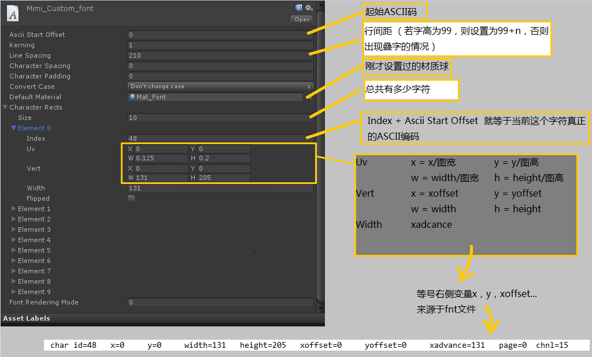

# unity3d

http://www.4399.com/flash/190144_1.htm
http://www.4399.com/flash/190981_3.htm

## 简单数据读写 PlayerPrefs
```
//写
PlayerPrefs.SetInt("LevelIndex", 1);
//读
var levelIndex = PlayerPrefs.GetInt("LevelIndex",0);

```

## 动画状态机
```
Animator animator = GetComponentInChildren<Animator>();
//播放动画
animator.Play("NetworkErrorHide");
//控制状态机变量
animator.SetBool("Close", true);
```

[判断一个动画播放结束](https://blog.csdn.net/W1095471150/article/details/52315935)

## CustomFont 自定义字体 fnt

```
1.用BMFont创建fnt字体
2.在Unity中创建同名的CustomFont
3.为CustomFont附上Material，格式是GUI/TextShader
4.使用脚本解析fnt文件自动填充到CustomFont
```

```
using UnityEngine;  
using UnityEditor;  
using System.Collections.Generic;  
using System.IO;  
using System.Text.RegularExpressions;  
    
// 创建bmfont  
public class CreateFontEditor : Editor  
{  
    [MenuItem("Assets/CreateBMFont")]  
    static void CreateFont()  
    {  
        Object obj = Selection.activeObject;  
        string fntPath = AssetDatabase.GetAssetPath(obj);  
        if (fntPath.IndexOf(".fnt") == -1) {  
            // 不是字体文件  
            return;  
        }  
    
        string customFontPath = fntPath.Replace(".fnt", ".fontsettings");  
        if (!File.Exists(customFontPath)) {  
            return;  
        }  
    
        Debug.Log(fntPath);  
        StreamReader reader = new StreamReader(new FileStream(fntPath, FileMode.Open));  
    
        List<CharacterInfo> charList = new List<CharacterInfo>();  
    
        Regex reg = new Regex(@"char id=(?<id>\d+)\s+x=(?<x>\d+)\s+y=(?<y>\d+)\s+width=(?<width>\d+)\s+height=(?<height>\d+)\s+xoffset=(?<xoffset>\d+)\s+yoffset=(?<yoffset>\d+)\s+xadvance=(?<xadvance>\d+)\s+");  
        string line = reader.ReadLine();  
        int lineHeight = 0;  
        int texWidth = 1;  
        int texHeight = 1;  
    
        while (line != null) {  
            if (line.IndexOf("char id=") != -1) {  
                Match match = reg.Match(line);  
                if (match != Match.Empty) {  
                    var id = System.Convert.ToInt32(match.Groups["id"].Value);  
                    var x = System.Convert.ToInt32(match.Groups["x"].Value);  
                    var y = System.Convert.ToInt32(match.Groups["y"].Value);  
                    var width = System.Convert.ToInt32(match.Groups["width"].Value);  
                    var height = System.Convert.ToInt32(match.Groups["height"].Value);  
                    var xoffset = System.Convert.ToInt32(match.Groups["xoffset"].Value);  
                    var yoffset = System.Convert.ToInt32(match.Groups["yoffset"].Value);  
                    var xadvance = System.Convert.ToInt32(match.Groups["xadvance"].Value);  
    
                    CharacterInfo info = new CharacterInfo();  
                    info.index = id;  
                    float uvx = 1f*x/texWidth;  
                    float uvy = 1 - (1f*y/texHeight);  
                    float uvw = 1f*width/texWidth;  
                    float uvh = -1f*height/texHeight;  
    
                    info.uvBottomLeft = new Vector2(uvx, uvy);  
                    info.uvBottomRight = new Vector2(uvx + uvw, uvy);  
                    info.uvTopLeft = new Vector2(uvx, uvy + uvh);  
                    info.uvTopRight = new Vector2(uvx + uvw, uvy + uvh);  
    
                    info.minX = xoffset;  
                    info.minY = yoffset + height / 2;   // 这样调出来的效果是ok的，原理未知  
                    info.glyphWidth = width;  
                    info.glyphHeight = -height; // 同上，不知道为什么要用负的，可能跟unity纹理uv有关  
                    info.advance = xadvance;  
    
                    charList.Add(info);  
                }  
            } else if (line.IndexOf("scaleW=") != -1) {  
                Regex reg2 = new Regex(@"common lineHeight=(?<lineHeight>\d+)\s+.*scaleW=(?<scaleW>\d+)\s+scaleH=(?<scaleH>\d+)");  
                Match match = reg2.Match(line);  
                if (match != Match.Empty) {  
                    lineHeight = System.Convert.ToInt32(match.Groups["lineHeight"].Value);  
                    texWidth = System.Convert.ToInt32(match.Groups["scaleW"].Value);  
                    texHeight = System.Convert.ToInt32(match.Groups["scaleH"].Value);  
                }  
            }  
            line = reader.ReadLine();  
        }  
    
        Font customFont = AssetDatabase.LoadAssetAtPath<Font>(customFontPath);  
        customFont.characterInfo = charList.ToArray();  
        AssetDatabase.SaveAssets();  
        AssetDatabase.Refresh();  
        Debug.Log(customFont);  
    }  
}  
```



## 3d声音 声音远近
```
3D声音

3D立体声和2D声不同的地方是它是会随着距离衰减的，距离越近声音越大，距离越远声音越小。

1: 声音: 背景音乐和音效;

2: 声音文件支持的格式: ogg, mp3, wave, AIFF;

　　ogg比较流行，很多安卓里面的声音使用ogg的格式是为了绕开mp3的版权

　　ogg和mp3都比较常用

　　wave和ogg、mp3比起来比较大，没有压缩的数字音乐，可以直接写到声卡里面

3:音频管理器: Edit-->ProjectSetting--> Audio;和物理引擎一样有管理器

   Global Volume: 全局播放的音量;

   Volume Rolloff Scale: 衰减因子，越大，声音衰减越快；

   Doppler Factor: 多普勒因子;模拟多普勒效应的监听效果:0关闭, 1 高速物体的多普勒效应会比较明显的监听的到;

   Default Speak Mode: 设置扬声器模式;默认值为2(立体声, AudioSpeakModer); stereo立体声

   System Sample Rate: (输出采样率);

   DSP Buffer Size: 调整DSP缓冲区大小优化延迟和性能;越大效果越好

   Max Virutal/Real Voices Count: 同时播放的真实声音的数量;虚拟的声音最后会和其他的声音混合在一起，所以比真实的声音多。

   Disable Unity Audio: 是否使用音频;

 

 

音频监听器

类似于人的耳朵，把耳朵移动到哪里，就可以听到那里附近的声音，也可以比喻为话筒。如果场景中没有音频监听器，那么玩家是听不到声音的，即使那个物体正在发声。

1: 音频监听器在3D世界中扮演话筒的角色，他接受场景中输入的音频源，通过设备的扬声器来播放声音;

2: 当一个音频监听器挂载到场景中的一个游戏对象上，任何音源如果接近音频监听器，都会输出到计算机的扬声器中,每个场景中只能有一个音频监听器，一般会默认的添加到主摄像机上;这样摄像机拍到哪里我们就监听哪里的声音。

　主摄像机初始化的时候也是带着Audio Listener组件的。

3: AudioClip: 声音文件，就是声音的资源文件

 

 

AudioSource(声源)

我们需要对声音进行衰减，需要计算监听器与声源的距离，需要对一些声源做混合，就要使用AudioSource组件，帮助我们播放AudioClip(音频文件)

1: 音频源: 在场景中播放音频剪辑,如果一个音频剪辑是一个3D，那么音频源就会在给定的位置，然后随着距离进行衰减,还可以在3D和2D之间进行切换;

2: 创建一个音频源:

    (1): 导入要播放的声音文件;

    (2): 创建一个节点，并加上Audio-->Audio Source组件;

    (3): 将AudioClip加入到AudioSource中；

    (4): 代码控制播放;

3:属性:

  AudioClip: 要被播放的文件;

  Output: 音频剪辑通过音频混合器输出;

  Mute: 是否静音;

  Play On Wake唤醒时播放;

  loop: 是否循环播放;

  Priority: 播放的优先级，0最高，256最低，默认128，优先级高的一般是重要的音效

  Volume 音量 Pitch 音调 Stereo Pan立体声(-1左声道, 1右声道)

  Spatial Blend(空间混合), 0为2D音效, 1为3D音效，2D音效不会做衰减

  Spread: (3D)立体声在扬声器空间中的传播速度;

  Volume Rolloff音量衰减模式: 对数(Logarithmic)，线性(Linear)和自定义模式(Custom)，自定义模式要自己加控制点。

  Min Distance/Max Distance衰减的范围，衰减距离的 开始结束, 最小距离(声音保持最大量),最大距离(不再衰减)

　　　　　　　　　　　　  当我们的音频监听器和声源的距离小于Min Distance的时候，都是最大声音，大于Max Distance的都是最小声音或者没有，这个取决于那个声音曲线的设置，一般自定义才可以设置超出Max距离后还有声音。

　　　　　　　　　　　　  当我们调节Min Distance/Max Distance的时候，Scene视图里面的声源球的范围也会随之改变，两个球体之间的部分就是有衰减的部分。
```

## 网络连接
```
NetworkReachability网络可达性
NetworkReachability.ReachableViaCarrierDataNetwork 通过运营商数据网络可达

NetworkReachability.ReachableViaLocalAreaNetwork 通过局域网络可达(wifi)

Application.internetReachability == NetworkReachability.NotReachable
```

## Mathf.Lerp 插值
Mathf.Lerp 插值
```
static functionLerp (from : float, to : float, t : float) : float

基于浮点数t返回a到b之间的插值，t限制在0～1之间。当t = 0返回from，当t = 1 返回to。当t = 0.5 返回from和to的平均值。
```
进度条动画
```
if (slider && slider.value != sliderValue) {
    float t = Time.deltaTime * moveSpeed / Mathf.Abs(sliderValue - slider.value);
    slider.value = Mathf.Lerp(slider.value, sliderValue, t);
}
```


## 相机跟随 Cinemachine
[相机跟随多个目标/单个目标/跟随切换](https://blog.csdn.net/l773575310/article/details/78068113?locationNum=6&fps=1)
[2d-follow-camera](https://unity3d.com/cn/learn/tutorials/topics/2d-game-creation/2d-follow-camera-w-cinemachine)


## 自动寻路 NavMeshAgent
[NavMeshAgent 寻路导航组件](https://blog.csdn.net/u013628121/article/details/53105022)
[unity的学习之NavMeshAgent,自动寻路](https://www.2cto.com/kf/201707/661343.html)

## 碰撞过滤
```
为GameObject设置不同的Layers，在菜单找到Edit->Project Settings->Physics2D->Layer Collision Matrix，选择需要忽略的碰撞
```


## Unity3D中texture2D函数使用详解
```
在Unity3D中可以使用脚本创建texture2D贴图，并对像素进行操作。


构造函数

Texture2D(int width, int height);

Texture2D(int width, int height, TextureFormat format, bool mipmap);

Texture2D(int width, int height, TextureFormat format, bool mipmap, bool linear);


方法

对像素的操作

1.获取像素颜色

Color GetPixel(int x, int y);

Returns pixel color at coordinates (x, y).

2.获取正交化坐标系下像素颜色

Color GetPixelBilinear(float u, float v);

Returns filtered pixel color at normalized coordinates (u, v).

多用于处理得知多边形UV坐标时对像素的处理

3.获取一个区块的像素颜色

Color[] GetPixels(int miplevel = 0);

Get a block of pixel colors.

获取以x,y 为起始点，大小为width,height的一个区块，

返回的是一个数组，数组内颜色的点顺序为从左至右，从下至上

4.获取（指定mipmap level级别）的整张贴图的像素颜色（使用Color32格式）

Color32[] GetPixels32(int miplevel = 0);

Get a block of pixel colors in Color32 format.

读取速度比反复使用getPixel读取速度快

5.设置像素颜色

void SetPixel(int x, int y, Color color);

Sets pixel color at coordinates (x,y).

6.设置（指定mipmap level级别）的整张贴图的像素颜色

void SetPixels(Color[] colors, int miplevel = 0);

Set a block of pixel colors.

设置指定mipmap level下的整张贴图颜色

7.设置（指定mipmap level级别）的整张贴图的像素颜色（使用Color32格式）

void SetPixels32(Color32[] colors, int miplevel = 0);

Set a block of pixel colors.


对贴图的操作

1.当对贴图的像素操作后必须调用的函数，使操作生效。

void Apply(bool updateMipmaps = true, bool makeNoLongerReadable = false);

Actually apply all previous SetPixel and SetPixels changes.

2.将贴图压缩成DXT格式

void Compress(bool highQuality);

Compress texture into DXT format.

3.将贴图转码为PNG格式

byte[] EncodeToPNG();

Encodes this texture into PNG format.

4.加载一张贴图

bool LoadImage(byte[] data);

Loads an image from a byte array.

可以加载的格式为:JPG,PNG

5.将多张贴图打包到一张图集中

Rect[] PackTextures(Texture2D[] textures, int padding, int maximumAtlasSize = 2048, bool makeNoLongerReadable = false);

Packs multiple Textures into a texture atlas.

6.将屏幕色读入到贴图

void ReadPixels(Rect source, int destX, int destY, bool recalculateMipMaps = true);

Read screen pixels into the saved texture data.

rect source 可以用来创建需要截取的屏幕区域，

destX，destY 表明了渲染到贴图的起始点，（0,0）点为屏幕的左下角。

readPixels函数主要可以配合camera.OnPostRender进行截图及RenderToTexture操作,

7.重新定义贴图

bool Resize(int width, int height, TextureFormat format, bool hasMipMap);

Resizes the texture.
```
[Unity3D中texture2D函数使用详解](https://blog.csdn.net/laverfever/article/details/19076663)

## tilemap
[教程](http://gad.qq.com/article/detail/38693)
[Unity 2017.2新功能](http://gad.qq.com/article/detail/34775)
[官方扩展](https://github.com/Unity-Technologies/2d-extras)
[Demo](https://github.com/MarekMarchlewicz/2D-Tilemap-Features)

## tilemap 地图编辑
```
1，新建地图
hierarchy对象窗口->create->2d object->tile map
2，打开笔刷窗口
window->tile palette
3，新建一个笔刷元素
project->create->tile
4,新建sprint
project->create->squer 此处也可以选择其他的形状
5,将tile的shprite设置为新建的sprite
6，将tile拖进 tile palette笔刷窗口
7，在grid中绘制地图
8，点击hierarchy窗口中的tilemap->添加组件 tilemap collider2d 添加碰撞
```
[unity3d 2017 tilemap 地图编辑](http://blog.csdn.net/lengyoumo/article/details/78907794)


## unity3D摄像机的快捷键调整

CTRL+SHIFT+F

在SCENE窗口调整好画面之后，选中相机，使用快捷键，然后就让GAME窗口显示的与SCENE窗口完全一致。


## Rigidbody如何使用代码冻结位置和旋转
```
 首先得到刚体组件

rigidbody = this.GetComponent<Rigidbody> ();

刚体里面的约束条件给他赋你想约束的值 

rigidbody.constraints=RigidbodyConstraints.FreezePositionY;

如果你想不冻结某个值其他都冻结的话

rigibody.constraints=~RigidbodyConstraints.FreezePositionY;
```

## FBX模型播放动画时的碰撞判断
Collider关联到骨骼


## 水 软体
首先Unity中自带的Water (Pro Only)和Water (Basic)包都是材质(shader)，是视觉上的水面表现。 要想完成你这个任务，需要流体物理模拟（Fluid Physics 或 Liquid Physics）。 可以去 Assets Store 上看看 Fluvio 这个插件，有免费版和示例工程。

## 3d模型碰撞检测
[Unity3D----导入模型的碰撞检测](http://blog.csdn.net/menuconfig/article/details/7995047)


## 加载3d模型及动画 fbx 
[3D模型的使用——FBX的使用与Animation设置 ](http://blog.csdn.net/yongh701/article/details/73001312)

## mac unity3d 双开
shell
```
cd ~
open -n /applications/Unity/Unity.app
```

## WebGL文件读取
导出Webgl版本Application.streamingAssetsPath文件读取
[Application.streamingAssetsPath and WebGL build](https://stackoverflow.com/questions/43693213/application-streamingassetspath-and-webgl-build)

```
IEnumerator loadStreamingAsset(string fileName)
{
    string filePath = System.IO.Path.Combine(Application.streamingAssetsPath, fileName);

    string result;
    if (filePath.Contains("://") || filePath.Contains(":///"))
    {
        WWW www = new WWW(filePath);
        yield return www;
        result = www.text;
    }
    else
        result = System.IO.File.ReadAllText(filePath);
}
```

## Unity学习

[Unity学习](https://unity3d.com/cn/learn/live-training)


## 相机 Camera
相机尺寸
```
camera.orthographicSize;
Screen.height / Screen.width;
```

## 着色器 Shader
[Unity3D Shader入门指南](https://onevcat.com/2013/07/shader-tutorial-1/)

[过场动画](http://blog.csdn.net/u013224660/article/details/49618715)

## Unity 路径

项目根目录路径
```
System.Environment.CurrentDirectory
```

Assets 文件夹的绝对路径
```
Application.dataPath
```

StreamingAssets 文件夹的绝对路径
```
case 1:
#if UNITY_EDITOR
	Application.streamingAssetsPath + "/" + path;
#elif UNITY_IPHONE
	Application.streamingAssetsPath + "/Raw/" + path;
#elif UNITY_ANDROID
	Application.streamingAssetsPath + "/" + path;
#endif

case 2:
#if UNITY_EDITOR
string filepath = Application.dataPath +"/StreamingAssets"+"/my.xml";
#elif UNITY_IPHONE
 string filepath = Application.dataPath +"/Raw"+"/my.xml";
#elif UNITY_ANDROID
 string filepath = "jar:file://" + Application.dataPath + "!/assets/"+"/my.xml;
```

Application.persistentDataPath
```
Application.streamingAssetsPath + "/" + path;
```

缓存路径
```
Application.temporaryCachePath
```

以上各路径中的资源加载方式都可以用WWW类加载，但要注意各个平台路径需要加的访问名称，例如Android平台的路径前要加"jar:file://"，其他平台使用"file://"。以下是各路径在各平台中的具体位置信息：
```
Android平台

Application.dataPath :  /data/app/xxx.xxx.xxx.apk
Application.streamingAssetsPath :  jar:file:///data/app/xxx.xxx.xxx.apk/!/assets
Application.persistentDataPath :  /data/data/xxx.xxx.xxx/files
Application.temporaryCachePath :  /data/data/xxx.xxx.xxx/cache
IOS平台
Application.dataPath :                    Application/xxxxxxxx-xxxx-xxxx-xxxx-xxxxxxxxxxxx/xxx.app/Data
Application.streamingAssetsPath : Application/xxxxxxxx-xxxx-xxxx-xxxx-xxxxxxxxxxxx/xxx.app/Data/Raw
Application.persistentDataPath :    Application/xxxxxxxx-xxxx-xxxx-xxxx-xxxxxxxxxxxx/Documents
Application.temporaryCachePath : Application/xxxxxxxx-xxxx-xxxx-xxxx-xxxxxxxxxxxx/Library/Caches
Windows Web Player
Application.dataPath :  file:///D:/MyGame/WebPlayer (即导包后保存的文件夹，html文件所在文件夹)
Application.streamingAssetsPath : 
Application.persistentDataPath : 
Application.temporaryCachePath : 
```

## 声音播放
```
_bgmObject = new GameObject("BGM");
DontDestroyOnLoad(_bgmObject);
var source = _bgmObject.AddComponent<AudioSource>();
source.clip = Resources.Load("框架BGM", typeof(AudioClip)) as AudioClip;
source.loop = true;
source.Play();
```

## 遍历场景中的所有对象
```
//遍历场景中的所有对象 Resources.FindObjectsOfTypeAll
//遍历场景中显示的对象
Button[] buttons = FindObjectsOfType(typeof(Button)) as Button[];
foreach (Button item in buttons)
{
    item.onClick.AddListener(()=>{
        Debug.Log("button");
    });
}
```

## 音效 格式

Unity3D游戏引擎一共支持4个音乐格式的文件
.AIFF  适用于较短的音乐文件可用作游戏打斗音效
.WAV  适用于较短的音乐文件可用作游戏打斗音效
.MP3  适用于较长的音乐文件可用作游戏背景音乐
.OGG  适用于较长的音乐文件可用作游戏背景音乐

## Plugins
[Plugins](http://blog.csdn.net/leonwei/article/details/39232969)

## dll import
[dllimport](https://docs.unity3d.com/Manual/30_search.html?q=dllimport)

## 场景过度动画

[场景过度动画](http://blog.csdn.net/u013224660/article/details/49618715)

## 线程（Thread）和协程（Coroutine）
```
StartCoroutine(DoSomething());
IEnumerator DoSomething() {
    //do something
    yield return new WaitForSeconds(3);
    //do something
}
```


```
D.S.Qiu觉得使用协程的作用一共有两点：1）延时（等待）一段时间执行代码；2）等某个操作完成之后再执行后面的代码。总结起来就是一句话：控制代码在特定的时机执行。

很多初学者，都会下意识地觉得协程是异步执行的，都会觉得协程是C# 线程的替代品，是Unity不使用线程的解决方案。

所以首先，请你牢记：协程不是线程，也不是异步执行的。协程和 MonoBehaviour 的 Update函数一样也是在MainThread中执行的。使用协程你不用考虑同步和锁的问题。
```

## Coroutine 常用yield返回值
```
常用的有：null，WaitForSeconds，WaitForEndOfFrame，WaitForFixedUpdate，Another Coroutine，WWW

1.null
它是会挂起一帧，下一帧会继续执行。

2.WaitForSeconds

它的用法如：yield return new WaitForSeconds(2f);，这样就会让当前Coroutine函数挂起2秒。

3.WaitForEndOfFrame

它的用法和null是一样的效果。

4.WaitForFixedUpdate

它和null类似，但是不是一帧，而是一个Fixed帧时间。

5.Another Coroutine

这个就是可以在悬挂的时候执行另一个Coroutine函数，知道Another Coroutine执行完毕才会继续执行。

6.WWW

这个会挂起等待一个网络响应，完毕以后会继续执行。

最后，注意一点，最好将协同代码写在执行层面，避免一些不要的麻烦。
```

## 龙骨DragonBones 事件
```
var com = obj.GetComponentInChildren<UnityArmatureComponent>();
string name = "zhuangji";
if (com && com.animation.HasAnimation(name)) {
    var ret = com.animation.Play(name, 1);
    com.AddDBEventListener(EventObject.COMPLETE, (string type, EventObject e)=>{
        if(e.animationState.name == name)
        {
            obj.SetActive(false);
        }
    });
}
else {
    obj.SetActive(false);
}
```

## Text 文字标签

Tag | Description | Example | Notes
-|-|-|-
b | Renders the text in boldface.| We are `<b>not</b>` amused. |
i | Renders the text in italics. | We are `<i>usually</i>` not amused. |
size | Sets the size of the text according to the parameter value, given in pixels. | We are `<size=50>largely</size>` unaffected. | Although this tag is available for Debug.Log, you will find that the line spacing in the window bar and Console looks strange if the size is set too large.
color |Sets the color of the text according to the parameter value. The color can be specified in the traditional HTML format.    #rrggbbaa …where the letters correspond to pairs of hexadecimal digits denoting the red, green, blue and alpha (transparency) values for the color. For example, cyan at full opacity would be specified by | `<color=#00ffffff>…` | Another option is to use the name of the color. This is easier to understand but naturally, the range of colors is limited and full opacity is always assumed.    `<color=cyan>…` The available color names are given in the table below.

## GameObject可见性 activeSelf activeInHierarchy

activeSelf| parent可见 | parent不可见
-|-|-
child可见 | true | true
child不可见| false | false

activeInHierarchy| parent可见 | parent不可见
-|-|-
child可见 | true | false
child不可见| false | false


## 动画播放以及动画拼接播放

[动画播放以及动画拼接播放](https://www.jianshu.com/p/72173e646f92)


## JSON转换异常

[Newtonsoft.Json部分操作系统不支持解决](http://blog.csdn.net/rnzuozuo/article/details/20455629)

[private static System.ComponentModel.Int64Converter _unused = new System.ComponentModel.Int64Converter();](http://blog.csdn.net/huutu/article/details/43986079)

[Unity上同时兼容Android和IOS的JSON库](http://blog.csdn.net/kakashi8841/article/details/21877131)


## 施加力

### 持续施加
```	
void FixedUpdate()
{
    Rigidbody2D rb2d;
    //施加力
    rb2.AddForce(offset);
}
```

### 瞬间施加
```
Rigidbody2D rb2d;
//施加力
rb2.AddForce(offset, ForceMode2D.Impulse);
```

## 修改重力

### 修改世界重力
<pre>
Physics2D.gravity
</pre>

### 修改物体重力
<pre>
Rigidbody2D rb2d;
rb2d.gravityScale = 1.0f;
</pre>


## RectTransform 操作

### 改变位置
1.改变RectTransform的top

GetComponent<RectTransform>().offsetMax = new Vector2(GetComponent<RectTransform>().offsetMax.x, top);

2.改变RectTransform的bottom

GetComponent<RectTransform>().offsetMin = new Vector2(GetComponent<RectTransform>().offsetMin.x, bottom);

3.改变RectTransform的width，height

GetComponent<RectTransform>().sizeDelta = new Vector2(width, height);

4.改变RectTransform的pos

GetComponent<RectTransform>().anchoredPosition3D = new Vector3(posx,posy,posz);

GetComponent<RectTransform>().anchoredPosition = new Vector2(posx,posy);

### 改变大小
GetComponent<RectTransform>().sizeDelta = new Vector2(x, y)


## 获取场景根节点下的对象列表
<pre>
var arr = SceneManager.GetActiveScene().GetRootGameObjects();
</pre>


## 场景跳转

<pre>
using UnityEngine.SceneManagement;
SceneManager.LoadScene("Home");
</pre>


## svn
[svn管理](http://blog.csdn.net/derxiu_xiu/article/details/52369225)


## 字体模糊 3dtext
先放大text的font，再缩小text的scale


## Unity延时

<pre>
    //重复调用  
    InvokeRepeating("LaunchProjectile", 1,5);//1秒后调用LaunchProjectile () 函数，之后每5秒调用一次    
    //调用一次  
    Invoke("LaunchProjectile", 5);//5秒后调用LaunchProjectile () 函数  
</pre>

- [Unity延时功能的几种实现](http://www.jianshu.com/p/e38b926a3b00)


## 平台及环境宏定义
<pre>
    #if UNITY_IOS || UNITY_ANDROID
    ...//这里的代码在IOS和Android平台都会编译
    #endif

    #if UNITY_ANDROID && UNITY_EDITOR
    ...//这里的代码只有在发布设置设置的是Android，且在编辑器里运行时才会编译
    #endif
</pre>


## Unity3D-在mac上使用VSCODE开发
- [Unity3D-在mac上使用VSCODE开发](http://blog.csdn.net/pz789as/article/details/53504724)


## 声音播放
- 添加组件方式播放
给GameObject添加AudioSource组件，设置AudioClip属性
- 代码方式播放


## 跨场景不销毁对象 单例
<pre>
    using UnityEngine;
    using System.Collections;
    
    public class Test : MonoBehaviour 
    {
        public GameObject audio;
        void Start () 
        {
            // 切换场景不施放对象
            DontDestroyOnLoad(audio);
        }
    }
</pre>


## 类型转换
<pre>
    // string 2 float
    float f;
    bool ret = float.TryParse(num, out f);
</pre>


## Unity3d和iOS交互
- unity3d调用iOS方法
1、在unity中声明外部函数
<pre>
    // DllImport这个方法相当于是告诉Unity，有一个unityToIOS函数在外部会实现。
    // 使用这个方法必须要导入System.Runtime.InteropServices;
    // 传递数据只能用以string类型
    [DllImport("__Internal")]
    private static extern void unityToIOS (string str);
</pre>
2、在iOS中实现外部函数
<pre>
    extern "C"
    {
        void functionName(char* str){
            // do something
        }
    }
</pre>

- iOS调用unity3d方法
<pre>
    // UnitySendMessage("gameobject", "Method",msg);
    // 向unity发送消息
    // 参数一为unity脚本挂载的gameobject
    // 参数二为unity脚本中要调用的方法名
    // 参数三为传递的数据，注意：传递的数据只能是char *类型
    const char* str = [[NSString stringWithFormat:@"10"] UTF8String];
    UnitySendMessage("Main Camera", "turnRight", str);
</pre>

- iOS中暂停恢复unity3d方法
<pre>
    UnityPause(true)
    UnityPause(false)
</pre>


## 热更新方案

- [热更新方案](http://blog.csdn.net/guofeng526/article/details/52662994)


## 网络游戏中的攻击判断

- [网络游戏中的攻击行为分析](http://job.17173.com/content/2011-03-28/20110328141845820,1.shtml)

- [网络游戏编程中如何应对并数据处理上的并发](https://www.zhihu.com/question/35703590)

<<网络游戏核心技术与实践>>

- [手游实时战斗的同步问题处理方案详解](http://www.gad.qq.com/article/detail/10121)

- [腾讯GAD](http://www.gad.qq.com/community/program)

尚好的青春


## 服务端

- [WebSocket实战](http://www.cnblogs.com/tinywan/p/6182411.html)

- [Workerman](http://www.workerman.net/)
- [链接1](http://www.workerman.net/gatewaydoc/advanced/push.html)
- [链接2](http://doc.workerman.net/315306)
- [链接3](http://www.workerman.net/gatewaydoc/advanced/file-monitor.html)

## 碰撞

在unity3d中，能检测碰撞发生的方式有两种，一种是利用碰撞器，另一种则是利用触发器。这两种方式的应用非常广泛。为了完整的了解这两种方式，我们必须理解以下概念：
    （一）碰撞器是一群组件，它包含了很多种类，比如：Box Collider，Capsule Collider等，这些碰撞器应用的场合不同，但都必须加到GameObjecet身上。
    （二）所谓触发器，只需要在检视面板中的碰撞器组件中勾选IsTrigger属性选择框。
    （三）在Unity3d中，主要有以下接口函数来处理这两种碰撞检测：

触发信息检测：
1.MonoBehaviour.OnTriggerEnter( Collider other )当进入触发器
2.MonoBehaviour.OnTriggerExit( Collider other )当退出触发器
3.MonoBehaviour.OnTriggerStay( Collider other )当逗留触发器

碰撞信息检测：
1.MonoBehaviour.OnCollisionEnter( Collision collisionInfo ) 当进入碰撞器
2.MonoBehaviour.OnCollisionExit( Collision collisionInfo ) 当退出碰撞器
3.MonoBehaviour.OnCollisionStay( Collision collisionInfo )  当逗留碰撞器

Unity2D:
MonoBehaviour.OnTriggerEnter2D( Collider2D other )


## 查找对象
<pre>
    var followCamera = GameObject.Find ("RenderCamera");
</pre>

## 查找子对象
<pre>
var temp = transform.Find("InfoText");
</pre>

## 添加预设体
<pre>
GameObject obj = (GameObject)Instantiate (Resources.Load ("BodyS"));
GameObject node = GameObject.Find ("Main Camera");
obj.transform.parent = node.transform;
</pre>

## 动态加载资源
<pre>
//资源放在Resources目录中 名称以unity中显示的名称为准
AudioClip clip = (AudioClip)Resources.Load("T-ara - DAY BY DAY", typeof(AudioClip));
</pre>


## 删除对象
<pre>
Destroy(gameObject)
</pre>

## 脚本所在的对象
<pre>
this.gameObject
</pre>


## 添加组件
<pre>
<xmp>AudioSource source = gameObject.AddComponent<AudioSource>();</xmp>
</pre>

## 查找对象上的脚本/组件 查找组件 查找脚本
<pre>
<xmp>Player info = obj.GetComponent<Player>();</xmp>
</pre>

## 获取MAC地址
<pre>
using UnityEngine;  
using System.Collections;  
using System.Net.NetworkInformation;  

public static string GetMacAddress()  
{  
    string physicalAddress = "";  

    NetworkInterface[] nice = NetworkInterface.GetAllNetworkInterfaces();  

    foreach (NetworkInterface adaper in nice)  
    {  

        Debug.Log(adaper.Description);  

        if (adaper.Description == "en0")  
        {  
            physicalAddress = adaper.GetPhysicalAddress().ToString();  
            break;  
        }  
        else  
        {  
            physicalAddress = adaper.GetPhysicalAddress().ToString();  

            if (physicalAddress != "")  
            {  
                break;  
            };  
        }  
    }  

    return physicalAddress;  
} 
</pre>

<pre>
NetworkInterface[] nis = NetworkInterface.GetAllNetworkInterfaces();  
foreach(NetworkInterface ni in nis )  
{  
    Name = ni.Name;  
    Des = ni.Description;  
    Type = ni.NetworkInterfaceType.ToString();  
    Mac = ni.GetPhysicalAddress().ToString();  
    Debug.Log("Name ="+ni.Name);  
    Debug.Log("Des="+ni.Description);  
    Debug.Log("Type ="+ ni.NetworkInterfaceType.ToString());  
    Debug.Log("Mac="+ni.GetPhysicalAddress().ToString());  
}  
</pre>


## 随机数
<pre>
Random.Range(0, Rang);
</pre>


## 获取时间
Unity中时间处理使用的是System.Datetime
<pre>
//取得现在的时间
System.DateTime now = System.DateTime.Now;
//得到任意时间的DateTime（年月日时分秒）
System.DateTime date1 = new DateTime(2010,8,18,16,32,0,DateTimeKind.Local);
</pre>

## 点击到游戏对象的判断
<pre>
Debug.DrawLine (Camera.main.ScreenToWorldPoint (UTouch.Point ()), Vector3.zero);
RaycastHit2D hit = Physics2D.Raycast (Camera.main.ScreenToWorldPoint (UTouch.Point ()), Vector2.zero);
if (hit.collider != null) {
    GameObject obj = hit.collider.gameObject;
    if (obj == this.gameObject) {
        obj.transform.localScale = new Vector3 (2.0f, 2.0f, obj.transform.localScale.y);
        change = true;
    }
}
</pre>


## 现有类方法扩展
方法参数中的this关键词
<pre>
public static class Universal {
    //string to vector3
    public static Vector3 ToVector3(this string text) {
        text = text.Replace ("(", "").Replace (")", "");
        string[] s = text.Split (',');
        if (s.Length == 3) {
            return new Vector3 (float.Parse (s [0]), float.Parse (s [1]), float.Parse (s [2]));
        }
        return Vector3.zero;
    }
}
</pre>

## 点击事件
鼠标和触摸通用点击判断
<pre>
public class UTouch {
    public static bool Began (){
        if (Input.GetMouseButtonDown (0)) {
            return true;
        } else if (Input.touchCount > 0 && Input.GetTouch (0).phase == TouchPhase.Began) {
            return true;
        }
        return false;
    }
    public static bool Moved (){
        if (Input.GetMouseButton (0)) {
            return true;
        } else if (Input.touchCount > 0 && Input.GetTouch (0).phase == TouchPhase.Moved) {
            return true;
        }
        return false;
    }
    public static bool Ended (){
        if (Input.GetMouseButtonUp (0)) {
            return true;
        } else if (Input.touchCount > 0 && Input.GetTouch (0).phase == TouchPhase.Ended) {
            return true;
        }
        return false;
    }
    public static bool Canceled (){
        if (Input.touchCount > 0 && Input.GetTouch (0).phase == TouchPhase.Canceled) {
            return true;
        }
        return false;
    }
    public static Vector2 Point() {
        if (Input.touchCount > 0) {
            return Input.GetTouch (0).position;
        } else {
            return Input.mousePosition;
        }
    }
}
</pre>

## 文件读写
<pre>
var fileAddress = Path.Combine (Application.persistentDataPath, "test.txt");
var fileInfo = new FileInfo (fileAddress);
StreamWriter w;
if (!fileInfo.Exists) {
    w = File.CreateText (fileAddress);
}
else {
    w = new StreamWriter (fileAddress);
}
w.WriteLine ("123");
w.Close ();

if (fileInfo.Exists) {
    StreamReader r = new StreamReader (fileAddress);
    var s = r.ReadToEnd ();
    Debug.Log (s);
    r.Close ();
}
</pre>

## 目录权限
iOS:
Application.dataPath :                    Application/xxxxxxxx-xxxx-xxxx-xxxx-xxxxxxxxxxxx/xxx.app/Data
Application.streamingAssetsPath : Application/xxxxxxxx-xxxx-xxxx-xxxx-xxxxxxxxxxxx/xxx.app/Data/Raw
Application.persistentDataPath :    Application/xxxxxxxx-xxxx-xxxx-xxxx-xxxxxxxxxxxx/Documents
Application.temporaryCachePath : Application/xxxxxxxx-xxxx-xxxx-xxxx-xxxxxxxxxxxx/Library/Caches

Android:
Application.dataPath :  /data/app/xxx.xxx.xxx.apk
Application.streamingAssetsPath :  jar:file:///data/app/xxx.xxx.xxx.apk/!/assets
Application.persistentDataPath :  /data/data/xxx.xxx.xxx/files
Application.temporaryCachePath :  /data/data/xxx.xxx.xxx/cache

Windows Web Player:
Application.dataPath :  file:///D:/MyGame/WebPlayer (即导包后保存的文件夹，html文件所在文件夹)
Application.streamingAssetsPath : 
Application.persistentDataPath : 
Application.temporaryCachePath : 

---------------------------------------------------------------------------------------------------
各目录权限：

根目录：StreamingAssets文件夹
<pre>
#if UNITY_EDITOR
string filepath = Application.dataPath +"/StreamingAssets"+"/my.xml";
#elif UNITY_IPHONE
 string filepath = Application.dataPath +"/Raw"+"/my.xml";
#elif UNITY_ANDROID
 string filepath = "jar:file://" + Application.dataPath + "!/assets/"+"/my.xml;
#endif
</pre>
根目录：Resources 文件夹
可以使用Resources.Load("名字"); 把文件夹中的对象加载出来

根目录：StreamingAssets 文件夹
可以使用Application.dataPath进行读操作
Application.dataPath： 只可读不可写，放置一些资源数据

Application.persistentDataPath
iOS与Android平台都可以使用这个目录下进行读写操作，可以存放各种配置文件进行修改之类的。
在PC上的地址是：C:\Users\用户名 \AppData\LocalLow\DefaultCompany\test


## SocketIO
  下载第三方socketio插件