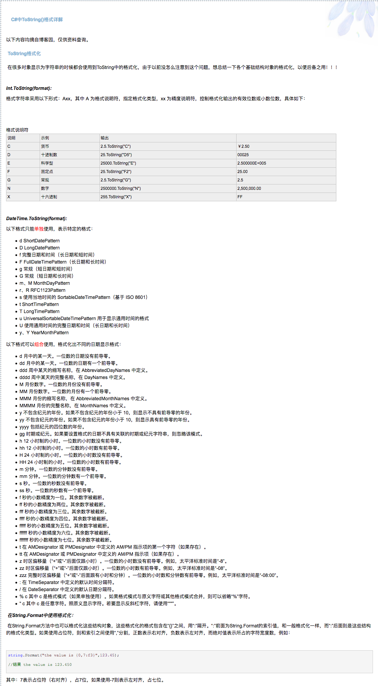
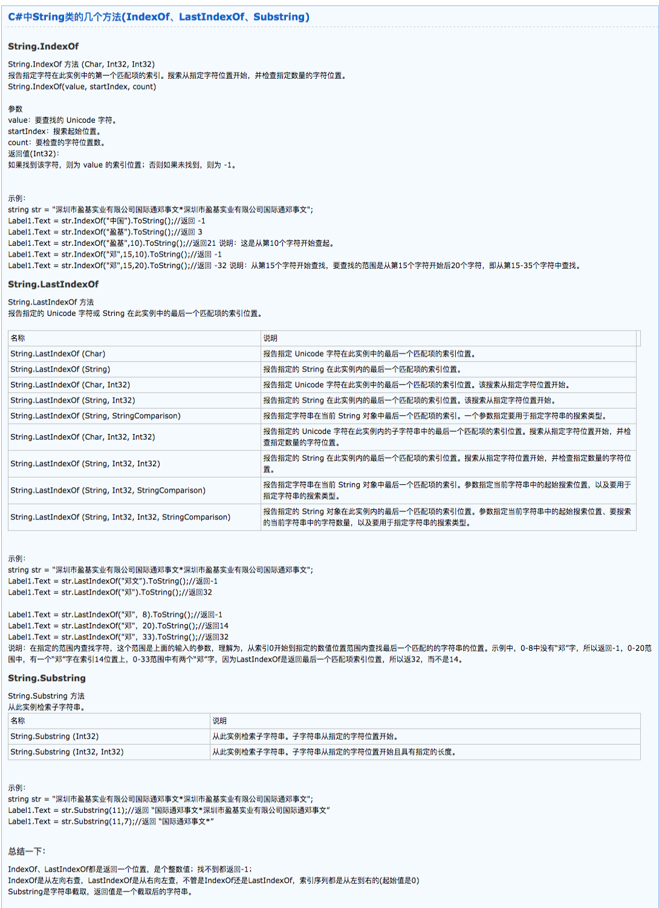

# C# #

## Action
```
System.Action action = ()=>{

};

System.Action OnAction += action;
System.Action OnAction -= action;
```

## C#中ToString()格式详解

[C#中ToString()格式详解](https://www.cnblogs.com/huangting2009/archive/2009/02/09/1386596.html)




## object

object 类型是 .NET Framework 中 Object 的别名。 在 C# 的统一类型系统中，所有类型（预定义类型、用户定义类型、引用类型和值类型）都是直接或间接从 Object 继承的。 可以将任何类型的值赋给 object 类型的变量。 将值类型的变量转换为对象的过程称为装箱。 将对象类型的变量转换为值类型的过程称为取消装箱。 有关详细信息，请参阅装箱和取消装箱。


## 委托

<pre>
class ABC {
	//委托申明
	public delegate void TestEventHandler(string str);

	public static void Main(string[] args) {
		//创建委托
		TestEventHandler t1 = new TestEventHandler(DEF.test);
		//调用委托
		t1("123");
		//同时委托多个方法(test、test2)
		t1 += new DEF().test2;
		t1("456");
	}
}

class DEF {
	//方法实现
	public static void test(string str) {

	}
	public void test2(string str) {

	}
}
</pre>

## 委托绑定

<pre>
//委托申明
public delegate void TestEventHandler(string str);
class ABC {
	public event TestEventHandler Test;

	void CallTest() {
		if (Test != null) {
			Test("123");
		}
	}
}

class DEF {
	public void methed(string str) {
		ABC abc = new ABC();
		//绑定实现方法
		abc.Test += new TestEventHandler(test);
	}
	public void test(string str) {

	}
}
</pre>


## 可变参数 params

<pre>
class ABC {
	public List<int> methed(params int[] p) {
		List<int> list = new List<int>();
		foreach (var item in p)
		{
			list.Add(item);
		}
		return list;
	}

	public void test (){
		var ret = methed(1,2,3);
	}
}
</pre>


## 泛型

<pre>
//泛型
public class ABC<T> {

	public T num{get;set;}

	public T Add(T item){
		return item;
	}

}
public class EFG {
	void Add() {
		ABC<int> abcd = new ABC<int>();
		abcd.num = 10;
		int num = abcd.num;
		num = abcd.Add(100);
	}
}
</pre>

## 泛型方法

<pre>
//泛型方法
public class ABC {
	public void AAA<T>(T t) {

	}
	public void Add<T>(List<T> t, params T[] p) {
		foreach (var item in p)
		{
			t.Add(item);
		}
	}
}

public class DEF {
	public void test() {
		ABC a = new ABC();
		a.AAA(100);
		List<int> t = new List<int>();
		a.Add(t, 1, 2, 3);
	}
}
</pre>

## 泛型约束

<pre>
泛型类中数据类型的约束
程序员在编写泛型类时，总是会对通用数据类型T进行有意或无意地有假想，也就是说这个T一般来说是不能适应所有类型，但怎样限制调用者传入的数据类型呢？这就需要对传入的数据类型进行约束，约束的方式是指定T的祖先，即继承的接口或类。因为C#的单根继承性，所以约束可以有多个接口，但最多只能有一个类，并且类必须在接口之前。这时就用到了C#2.0的新增关键字：

public class Node<T, V> where T : Stack, IComparable

        where V: Stack

    {...}

以上的泛型类的约束表明，T必须是从Stack和IComparable继承，V必须是Stack或从Stack继承，否则将无法通过编译器的类型检查，编译失败。

通用类型T没有特指，但因为C#中所有的类都是从object继承来，所以他在类Node的编写中只能调用object类的方法，这给程序的编写造成了困难。比如你的类设计只需要支持两种数据类型int和string，并且在类中需要对T类型的变量比较大小，但这些却无法实现，因为object是没有比较大小的方法的。 了解决这个问题，只需对T进行IComparable约束，这时在类Node里就可以对T的实例执行CompareTo方法了。这个问题可以扩展到其他用户自定义的数据类型。

如果在类Node里需要对T重新进行实例化该怎么办呢？因为类Node中不知道类T到底有哪些构造函数。为了解决这个问题，需要用到new约束：

public class Node<T, V> where T : Stack, new()

        where V: IComparable

需要注意的是，new约束只能是无参数的，所以也要求相应的类Stack必须有一个无参构造函数，否则编译失败。

C#中数据类型有两大类：引用类型和值类型。引用类型如所有的类，值类型一般是语言的最基本类型，如int, long, struct等，在泛型的约束中，我们也可以大范围地限制类型T必须是引用类型或必须是值类型，分别对应的关键字是class和struct:

public class Node<T, V> where T : class

        where V: struct
</pre>


## 接口 接口方法 接口属性
## 抽象类 抽象方法 抽象属性

<pre>

//接口
interface IInterface
{
	//接口方法
	void InterfaceMethed1();
	void InterfaceMethed2();

	//接口属性
	int interfaceNum1{get;set;}
	int interfaceNum2{get;set;}
}


//抽象类
abstract class ABC : IInterface{
	//抽象方法
	public abstract void AbsMethed();
	//正常方法
	public void Methed() {
		
	}

	//抽象属性
	public abstract int absNum {get;set;}
	//正常属性
	public int num;


	//接口方法变为抽象方法
	public abstract void InterfaceMethed1();
	//接口方法实现
	public void InterfaceMethed2() {

	}
	//接口属性
	public abstract int interfaceNum1{get;set;}
	public int interfaceNum2{get;set;}
}


//正常类
class DEF : ABC
{
	public override void AbsMethed() {

	}

	public override int absNum{get;set;}

	public override void InterfaceMethed1() {

	}

	public override int interfaceNum1{get;set;}
}

</pre>


## 枚举

<pre>
public enum TimeOfDay
{
    Moning = 0,
    Afternoon = 1,
    Evening = 2,
};
</pre>

- [C#的枚举](https://www.cnblogs.com/yank/archive/2009/02/27/1399423.html)


## string


## key存在判断
<pre>
dic.ContainsKey(key)
</pre>